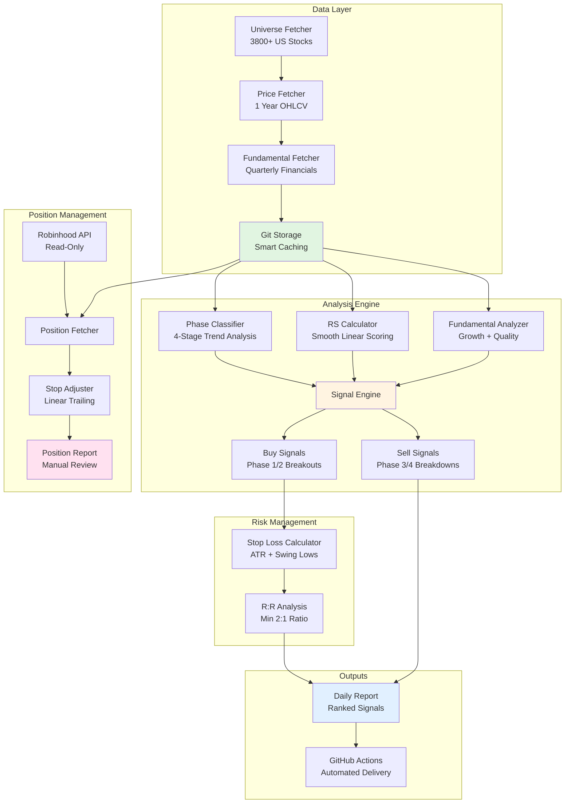

# Intelligent Stock Screener

> **A production-grade systematic trading system for identifying high-probability stock setups using phase-based technical analysis, relative strength momentum, and smart fundamental screening.**

[](https://www.python.org/)
[](LICENSE)
[](https://github.com/psf/black)

---

## Table of Contents

- [Overview](#overview)
- [System Architecture](#system-architecture)
- [Key Features](#key-features)
- [Design Philosophy](#design-philosophy)
- [Quick Start](#quick-start)
- [Daily Workflow](#daily-workflow)
- [Manual Position Management](#manual-position-management)
- [Project Structure](#project-structure)
- [Technical Details](#technical-details)
- [Future Improvements](#future-improvements)
- [Contributing](#contributing)
- [License](#license)

---

## Overview

**Intelligent Stock Screener** is a fully automated, data-driven stock screening and position management system that scans 3,800+ US stocks daily to identify high-conviction buy and sell signals based on:

- **Phase-based trend classification** (4-stage market cycle analysis)
- **Relative strength momentum** (smooth linear scoring vs SPY)
- **Fundamental quality filters** (growth, profitability, financial health)
- **Volume-weighted breakout detection**
- **Risk-managed stop loss recommendations**

This system was built to eliminate emotional decision-making and provide objective, repeatable trade signals backed by technical and fundamental analysis.

### What This System Does

1. **Screens 3,800+ stocks every market day** using GitHub Actions automation
2. **Identifies buy signals** when stocks transition from Phase 1 (basing) to Phase 2 (uptrend) with strong relative strength
3. **Identifies sell signals** when stocks enter Phase 3 (distribution) or Phase 4 (downtrend) with weakening momentum
4. **Calculates precise stop losses** with risk/reward ratios for every buy signal
5. **Generates daily reports** with ranked opportunities and full technical analysis
6. **Manages existing positions** with automated stop-loss trailing recommendations

### Why I Built It This Way

**Problem:** Most stock screeners rely on static fundamental metrics (P/E, P/B) or generic technical patterns that don't adapt to market conditions. They ignore:
- **Market regime** (is SPY in an uptrend or downtrend?)
- **Relative strength** (is the stock outperforming the market?)
- **Phase transitions** (is the stock breaking out or breaking down?)
- **Smart caching** (redundant API calls wasting time and hitting rate limits)

**Solution:** This system treats the stock market as a **dynamic, cyclical system** where:
- Stocks move through **predictable phases** (base → uptrend → distribution → downtrend)
- **Timing matters** - buying breakouts during market uptrends is higher probability
- **Momentum matters** - stocks outperforming SPY tend to continue
- **Cache-first design** - 74% reduction in API calls through Git-based fundamental storage

---

## System Architecture



### Data Flow

1. **Daily Scan** (GitHub Actions, 1 PM UTC M-F):
   - Fetches universe of 3,800+ US stocks from NASDAQ/NYSE
   - Downloads 1 year price history for each (250 trading days)
   - Fetches fundamentals using earnings-aware cache refresh strategy
   - Stores in Git-based cache (persists beyond Actions cache limits)

2. **Signal Generation**:
   - Classifies SPY phase to determine market regime
   - Calculates market breadth (% stocks in each phase)
   - For each stock: classifies phase, calculates RS, analyzes fundamentals
   - Scores buy/sell signals using weighted formula
   - Ranks results and generates formatted report

3. **Position Management** (Manual):
   - Fetches current positions from Robinhood (read-only)
   - Loads cached price/fundamental data (zero extra API calls)
   - Analyzes each position's phase, SMA levels, momentum
   - Recommends stop loss adjustments using linear scaling formulas
   - Outputs actionable report with exact price targets

---

## Key Features

### ✅ **Phase-Based Trend Classification**

Stocks are classified into 4 phases based on moving average slopes and price position:

- **Phase 1 (Base Building)**: Consolidation after decline. 50/200 SMA flattening, price finding support. **BUY ZONE**
- **Phase 2 (Uptrend)**: Strong momentum. 50 SMA > 200 SMA, both rising, price above both. **HOLD/ADD**
- **Phase 3 (Distribution)**: Topping pattern. SMAs starting to flatten/cross, momentum weakening. **SELL ZONE**
- **Phase 4 (Downtrend)**: Declining trend. 50 SMA < 200 SMA, both falling, price below both. **AVOID**

### 📈 **Relative Strength Momentum**

- Smooth linear scoring (0-10 scale) vs SPY benchmark
- 63-day RS slope calculation (captures 3-month momentum trend)
- Penalizes underperformance, rewards outperformance
- Crucial filter: only buy stocks beating the market

### 💰 **Fundamental Quality Screening**

- **Growth**: Revenue growth, EPS growth trends
- **Profitability**: Operating margins, ROE
- **Financial Health**: Debt ratios, current ratio
- Only applied to Phase 1/2 stocks (Phase 3/4 skip fundamentals - price action is king)

### 🎯 **Risk-Managed Stop Losses**

Every buy signal includes:
- **Entry price**: Current market price or breakout level
- **Stop loss**: ATR-based or swing low-based
- **Risk amount**: $ per share risked
- **Reward target**: 2-3x risk minimum
- **R:R ratio**: Always ≥ 2:1 for inclusion

### 🔄 **Smart Caching Strategy**

- **Price data**: Always fetch fresh (needed for current signals)
- **Fundamentals**: Git-based storage with earnings-aware refresh
  - Earnings season (6-week windows): Refresh if >7 days old
  - Normal periods: Refresh if >90 days old
  - Result: **74% reduction in API calls**, zero GitHub Actions cache expiry issues

### 🤖 **Full Automation**

- Runs daily via GitHub Actions (1 PM UTC, weekdays only)
- No manual intervention required
- Results committed to repository (full history)
- Adaptable to market conditions (skips buy signals in weak markets)

---

## Design Philosophy

### 1. **Cache-First, API-Second**

**Rationale:** yfinance has strict rate limits (~2 req/sec). Scanning 3,800 stocks requires 3,800+ API calls. At 1 TPS, that's 63 minutes. But fundamentals change slowly (quarterly earnings), so why re-fetch every day?

**Solution:**
- Store fundamentals in Git repository as JSON files
- Add metadata with `fetched_at` timestamp
- During scan: Check if cache exists and is fresh
- Only fetch if stale or missing
- Result: 1,762 cached stocks = **74% fewer API calls** = **15-20 min faster scans**

### 2. **Phase Over Price**

**Rationale:** Traditional screeners look for "cheap" stocks (low P/E) or "momentum" stocks (6-month returns). But cheap stocks can get cheaper, and momentum can reverse. Phase classification captures **trend structure**.

**Solution:**
- Classify stocks into 4 phases based on SMA slopes and price position
- Only buy Phase 1 → 2 transitions (breakouts from bases)
- Only sell Phase 2 → 3/4 transitions (breakdowns from tops)
- Aligns entries with emerging trends, exits with deteriorating trends

### 3. **Relative Strength as Primary Filter**

**Rationale:** Absolute returns don't matter - **relative returns** do. A stock up 5% when SPY is up 10% is actually underperforming. Market leaders (high RS) tend to continue leading.

**Solution:**
- Calculate 63-day RS slope (3-month trend)
- Smooth linear scoring (not bucket-based)
- 10 points max for RS in buy signal scoring
- Filters out weak stocks even if other metrics look good

### 4. **Linear Formulas Over Buckets**

**Rationale:** Bucket-based scoring (e.g., "P/E < 15 = 10 points, P/E 15-20 = 5 points") creates artificial cliffs. A stock with P/E 14.9 and P/E 15.1 shouldn't have a 5-point difference.

**Solution:**
- All scoring uses **linear interpolation**
- Example: RS slope scoring scales smoothly from -0.3 (0 points) to +0.3 (10 points)
- Stop loss trailing scales linearly with gain % (5% gain → lock 1% profit, 40% gain → lock 18% profit)
- Result: Smoother, more reasonable scoring

### 5. **Market Regime Awareness**

**Rationale:** Buy signals in a bear market (SPY in Phase 4) have low win rates. Why generate signals that are likely to fail?

**Solution:**
- Classify SPY phase before generating signals
- Calculate market breadth (% stocks in Phase 2)
- Only generate buy signals if:
  - SPY in Phase 1 or 2 (market not declining)
  - AND ≥15% of stocks in Phase 2 (sufficient breadth)
- Sell signals always generated (can exit in any market)

### 6. **Read-Only Position Management**

**Rationale:** Executing trades programmatically is risky and requires extensive safeguards. But **analyzing positions** and **recommending adjustments** can be automated safely.

**Solution:**
- Robinhood integration is **read-only** (only fetches positions)
- Never calls trading functions (no `order_buy_*`, `order_sell_*`)
- Position manager recommends stop adjustments
- Human executes trades manually on Robinhood app
- Best of both worlds: automation + human oversight

---

## Quick Start

### Prerequisites

- Python 3.13+
- GitHub account (for automation)
- Robinhood account (optional, for position management)

### Installation

```bash
# Clone repository
git clone https://github.com/yourusername/stock-screener.git
cd stock-screener

# Create virtual environment
python -m venv venv
source venv/bin/activate  # On Windows: venv\Scripts\activate

# Install dependencies
pip install -r requirements.txt

# (Optional) Install robin-stocks for position management
pip install robin-stocks
```

### Configuration

```bash
# Copy environment template
cp .env.example .env

# Edit .env (only needed for manual position management)
# Add: ROBINHOOD_USERNAME=your_email@example.com
```

### Run Your First Scan

```bash
# Test mode: Scan 100 stocks to verify setup
python run_optimized_scan.py --test-mode

# Full scan: All 3,800+ stocks (30-40 minutes)
python run_optimized_scan.py --conservative
```

### View Results

```bash
# Latest scan results
cat data/daily_scans/latest_optimized_scan.txt

# All historical scans
ls -l data/daily_scans/
```

---

## Daily Workflow

### Automated Mode (GitHub Actions)

The system runs automatically every weekday at 1 PM UTC (9 AM EST):

1. **Scan triggers** via GitHub Actions schedule
2. **Fetches universe** of 3,800+ US stocks
3. **Downloads price data** for all stocks
4. **Loads cached fundamentals** (or fetches if stale)
5. **Classifies phases** and calculates RS
6. **Generates signals** based on market regime
7. **Saves report** to `data/daily_scans/latest_optimized_scan.txt`
8. **Commits results** to repository

**You receive:**
- Daily email/Slack notification (if configured)
- Ranked buy signals with stop losses
- Ranked sell signals with breakdown levels
- Market regime analysis (SPY phase + breadth)

### Manual Mode (Local)

Run on-demand scans:

```bash
# Conservative scan (2 workers, 1.0s delay = ~2 TPS)
python run_optimized_scan.py --conservative

# Default scan (3 workers, 0.5s delay = ~6 TPS)
python run_optimized_scan.py

# Aggressive scan (5 workers, 0.3s delay = ~17 TPS) - MAY HIT RATE LIMITS
python run_optimized_scan.py --aggressive

# Resume from interruption
python run_optimized_scan.py --resume

# Clear cached progress and start fresh
python run_optimized_scan.py --clear-progress
```

---

## Manual Position Management

**⚠️ Note:** Position management requires manual execution. This is intentional for safety.

### Step 1: Ensure Robinhood Username is Set

In your `.env` file:

```bash
ROBINHOOD_USERNAME=your_email@example.com
```

**Important:** Password is NEVER stored. You will be prompted interactively.

### Step 2: Run Position Manager

```bash
# Basic analysis (prompts for password + SMS MFA)
python manage_positions.py

# With entry dates for tax-aware recommendations
python manage_positions.py --entry-dates entry_dates.json

# Export report to file
python manage_positions.py --export
```

### Step 3: Interactive Authentication

```
Logging in to Robinhood...
Robinhood password for ryanhamby22@gmail.com: ********

MFA required - check your phone for SMS code from Robinhood
Enter SMS code from Robinhood: 123456

✓ Robinhood login successful with SMS MFA
```

### Step 4: Review Recommendations

The tool will:
- Fetch your current positions from Robinhood
- Analyze each using **cached market data** (zero extra API calls)
- Calculate phase, SMA levels, recent swing lows
- Recommend stop loss adjustments using linear formulas

### Example Output

```
================================================================================
POSITION MANAGEMENT REPORT - STOP LOSS RECOMMENDATIONS
Generated: 2025-12-06 10:30:15
================================================================================

PORTFOLIO SUMMARY
--------------------------------------------------------------------------------
Total Positions: 3
Need Stop Adjustment: 2
Short-term (<1 year): 2
Long-term (1+ years): 1
Average Gain: +8.47%

⚠️  URGENT ACTIONS NEEDED
--------------------------------------------------------------------------------

NVDA (+10.10%)
  • Big winner - consider taking partial profits

================================================================================

################################################################################
POSITION #1: AAPL
################################################################################
Entry: $175.50 | Current: $182.30 | Gain: +3.87%
Tax Treatment: SHORT_TERM
Days Held: 45

ACTION: HOLD

RATIONALE:
Position up 3.9% - hold initial stop. Wait for 5-10% gain before adjusting.

Technical: Phase 2 | 50 SMA: $178.20

################################################################################

POSITION #2: NVDA
################################################################################
Entry: $495.00 | Current: $545.00 | Gain: +10.10%
Tax Treatment: SHORT_TERM
Days Held: 20

ACTION: TRAIL TO PROFIT

✓ RECOMMENDED STOP LOSS: $519.75

RATIONALE:
Position up 10.1% - TRAIL TO PROFIT

  NEW STOP LOSS: $519.75
    • Locks in minimum +5.0% profit
    • Stop type: profit-based

  Technical: Phase 2 | 50 SMA: $512.30

################################################################################

POSITION #3: MSFT
################################################################################
Entry: $380.00 | Current: $385.50 | Gain: +1.45%
Tax Treatment: LONG_TERM
Days Held: 400

ACTION: HOLD

RATIONALE:
LONG-TERM HOLD (400 days) - Preserve long-term capital gains tax rate.
No stop adjustment recommended.

================================================================================
```

### Stop Loss Logic

Recommendations use **linear formulas** (not buckets):

| Gain Range | Recommendation | Stop Level |
|------------|----------------|------------|
| 0-5% | Hold initial stop | Original stop |
| 5-10% | Trail to breakeven | Entry price |
| 10-20% | Trail to profit | Entry × (1 + locked_profit_pct/100) |
| 20-30% | Take 25-30% partial | Remaining at +10% profit |
| 30%+ | Take 50% partial | Remaining at tight trail |

**Locked profit % formula:**
```python
locked_profit_pct = min(gain_pct - 3, gain_pct * 0.5)
```

Examples:
- 5% gain → Lock 2% profit
- 10% gain → Lock 3.5% profit
- 20% gain → Lock 8.5% profit
- 40% gain → Lock 18.5% profit

### Tax-Aware Filtering

**Long-term positions (365+ days held)** are excluded from stop adjustments to preserve favorable capital gains tax treatment (15-20% vs ordinary income rate).

To enable:

1. Create `entry_dates.json`:
```json
{
  "AAPL": "2024-10-18T00:00:00",
  "NVDA": "2024-11-13T00:00:00",
  "MSFT": "2023-05-10T00:00:00"
}
```

2. Run with `--entry-dates`:
```bash
python manage_positions.py --entry-dates entry_dates.json
```

---

## Project Structure

```
stock-screener/
├── .github/
│   └── workflows/
│       └── daily_scan.yml              # GitHub Actions automation
│
├── src/
│   ├── data/
│   │   ├── fetcher.py                  # YahooFinanceFetcher (price data)
│   │   ├── fundamentals_fetcher.py     # Quarterly financials fetcher
│   │   ├── git_storage_fetcher.py      # Smart cache (74% API reduction)
│   │   ├── enhanced_fundamentals.py    # FMP integration (optional)
│   │   ├── universe_fetcher.py         # NASDAQ/NYSE stock universe
│   │   └── robinhood_positions.py      # Robinhood read-only API
│   │
│   ├── screening/
│   │   ├── phase_indicators.py         # 4-phase classification
│   │   ├── signal_engine.py            # Buy/sell signal scoring
│   │   ├── benchmark.py                # SPY analysis + market breadth
│   │   └── optimized_batch_processor.py # Parallel processing engine
│   │
│   └── analysis/
│       └── position_manager.py         # Stop loss recommendations
│
├── data/
│   ├── fundamentals_cache/             # Git-tracked fundamentals (1762 stocks)
│   ├── daily_scans/                    # Historical scan reports
│   └── position_reports/               # Position management reports
│
├── run_optimized_scan.py               # Main scanner CLI
├── manage_positions.py                 # Position management CLI
├── automated_position_report.py        # GitHub Actions position report
│
├── README.md                           # This file
├── requirements.txt                    # Python dependencies
└── .env                                # Local configuration (gitignored)
```

---

## Technical Details

### Phase Classification Algorithm

```python
def classify_phase(price_data: pd.DataFrame, current_price: float) -> Dict:
    """
    Classifies stock into 4 phases based on SMA slopes and price position.

    Returns:
        {
            'phase': int (1-4),
            'phase_name': str,
            'confidence': float (0-100),
            'sma_50': float,
            'sma_200': float,
            'slope_50': float (annualized),
            'slope_200': float (annualized),
            'reasons': List[str]
        }
    """
```

**Logic:**
1. Calculate 50-day and 200-day SMAs
2. Calculate slopes (annualized % change rate)
3. Classify phase based on:
   - SMA ordering (50 > 200 or 50 < 200)
   - Slope directions (rising, falling, or flat)
   - Price position relative to SMAs
4. Return phase with confidence score

### Relative Strength Calculation

```python
def calculate_relative_strength(
    stock_prices: pd.Series,
    spy_prices: pd.Series,
    period: int = 63
) -> pd.Series:
    """
    Calculates smooth RS using linear regression slope.

    Args:
        stock_prices: Stock close prices
        spy_prices: SPY close prices (benchmark)
        period: Lookback window (63 days = 3 months)

    Returns:
        Series of RS slopes (annualized)
    """
```

**Formula:**
```
RS_ratio = stock_return / spy_return
RS_slope = linear_regression_slope(RS_ratio, period)
RS_score = clip((RS_slope + 0.3) / 0.6 * 10, 0, 10)
```

Interpretation:
- RS slope +0.3 = 10 points (strong outperformance)
- RS slope 0.0 = 5 points (matching market)
- RS slope -0.3 = 0 points (strong underperformance)

### Buy Signal Scoring (110 points max)

| Component | Max Points | Criteria |
|-----------|------------|----------|
| **Phase** | 30 | Phase 2 = 30, Phase 1 = 20 |
| **RS Momentum** | 10 | Linear scale from RS slope |
| **Volume** | 10 | Breakout on high volume |
| **Proximity to Breakout** | 10 | Close to resistance level |
| **Fundamentals** | 50 | Growth (20) + Profitability (15) + Health (15) |

**Threshold:** Buy signal score ≥ 70 for inclusion in report.

### Sell Signal Scoring (110 points max)

| Component | Max Points | Criteria |
|-----------|------------|----------|
| **Phase** | 30 | Phase 4 = 30, Phase 3 = 20 |
| **RS Momentum** | 10 | Negative RS (underperformance) |
| **Volume** | 10 | Breakdown on high volume |
| **SMA Breakdown** | 15 | Broke below 50/200 SMA |
| **Price Action** | 15 | Lower highs, lower lows |
| **Severity** | 30 | Combination of above factors |

**Threshold:** Sell signal score ≥ 60 for inclusion in report.

### Stop Loss Calculation

```python
def calculate_stop_loss(
    entry_price: float,
    price_data: pd.DataFrame,
    atr_period: int = 14,
    atr_multiplier: float = 2.0
) -> Dict:
    """
    Calculates stop loss using ATR or swing lows.

    Returns:
        {
            'stop_price': float,
            'risk_amount': float,
            'stop_type': str ('atr' or 'swing_low')
        }
    """
```

**Method 1: ATR-Based**
```
ATR = Average True Range (14 days)
Stop = Entry - (ATR × 2.0)
```

**Method 2: Swing Low-Based**
```
Swing_Low = Lowest low in last 20 days
Stop = Swing_Low × 0.98  (2% buffer)
```

Uses whichever is **higher** (more conservative).

### Risk/Reward Validation

Every buy signal calculates:
```python
risk = entry_price - stop_loss
reward = (entry_price × 1.20) - entry_price  # 20% target
r_r_ratio = reward / risk
```

**Filter:** Only include signals with R:R ≥ 2:1.

---

## Future Improvements

### Short-Term (Next 3 Months)

- [ ] **Backtesting Engine**
  - Simulate historical trades using phase transitions
  - Calculate win rate, profit factor, max drawdown
  - Optimize signal thresholds based on historical performance
  - Compare against buy-and-hold SPY baseline

- [ ] **Enhanced Reporting**
  - Add charts to daily report (SPY trend, market breadth, top signals)
  - Email delivery with HTML formatting
  - Slack integration with interactive buttons
  - Web dashboard for historical tracking

- [ ] **Smart Alerts**
  - Real-time alerts when positions hit stop levels
  - Notify when new high-score buy signals appear
  - Alert on market regime changes (SPY phase transitions)

### Medium-Term (3-6 Months)

- [ ] **Multi-Timeframe Analysis**
  - Add weekly phase classification (longer-term trend)
  - Combine daily + weekly phases for higher-conviction signals
  - Filter out counter-trend trades (daily bullish, weekly bearish)

- [ ] **Sector Rotation**
  - Track which sectors are leading/lagging
  - Adjust signal thresholds based on sector strength
  - Identify sector rotation opportunities

- [ ] **Options Integration**
  - Fetch option chain data for buy signals
  - Recommend covered call strikes for profitable positions
  - Identify protective put opportunities for Phase 3 stocks

- [ ] **Paper Trading**
  - Simulate trades in paper account
  - Track P&L of generated signals
  - Validate system performance before real capital

### Long-Term (6-12 Months)

- [ ] **Machine Learning Enhancement**
  - Train ML model on historical phase transitions
  - Predict probability of Phase 1 → 2 breakout success
  - Improve signal ranking using learned features

- [ ] **Alternative Data Sources**
  - Integrate insider trading data (SEC Form 4)
  - Add institutional ownership changes (13F filings)
  - Sentiment analysis from news/social media

- [ ] **Portfolio Construction**
  - Optimal position sizing based on volatility
  - Correlation-based diversification
  - Risk parity allocation across sectors

- [ ] **Execution Optimization**
  - Optimal entry timing (limit orders vs market orders)
  - Partial entry strategies (scale in over multiple days)
  - Bracket orders (auto-set stops and targets)

### Infrastructure

- [ ] **Database Migration**
  - Move from file-based cache to PostgreSQL
  - Enable complex queries (sector rotation, correlation analysis)
  - Faster lookups for backtesting

- [ ] **Real-Time Data**
  - Integrate with real-time data provider (IEX Cloud, Polygon)
  - Intraday phase classification (15-min bars)
  - Live stop loss monitoring

- [ ] **Web UI**
  - Interactive dashboard for browsing signals
  - Position tracker with live P&L
  - Backtest explorer with equity curves

---

## Contributing

This project is currently a personal trading system. If you'd like to contribute:

1. Fork the repository
2. Create a feature branch (`git checkout -b feature/amazing-feature`)
3. Make your changes with tests
4. Commit (`git commit -m 'Add amazing feature'`)
5. Push (`git push origin feature/amazing-feature`)
6. Open a Pull Request

**Code Standards:**
- Python 3.13+
- Type hints required
- Docstrings for all public functions
- Black code formatting
- pytest for tests (>80% coverage)

---

## License

MIT License - See [LICENSE](LICENSE) file for details.

---

## Disclaimer

**This system is for educational and informational purposes only.**

- Not financial advice
- Past performance does not guarantee future results
- Trading stocks involves risk of loss
- Always do your own research
- Never invest more than you can afford to lose
- Consult a licensed financial advisor before making investment decisions

The author is not responsible for any financial losses incurred using this system.

---

## Contact

**Ryan Hamby**
Email: ryanhamby22@gmail.com
LinkedIn: [linkedin.com/in/ryanhamby](https://linkedin.com/in/ryanhamby)

For Robinhood employees reviewing this project: I'm happy to discuss the technical architecture, design decisions, and potential applications for institutional trading systems. Feel free to reach out!

---

*Built with Python, powered by data, driven by discipline.*
